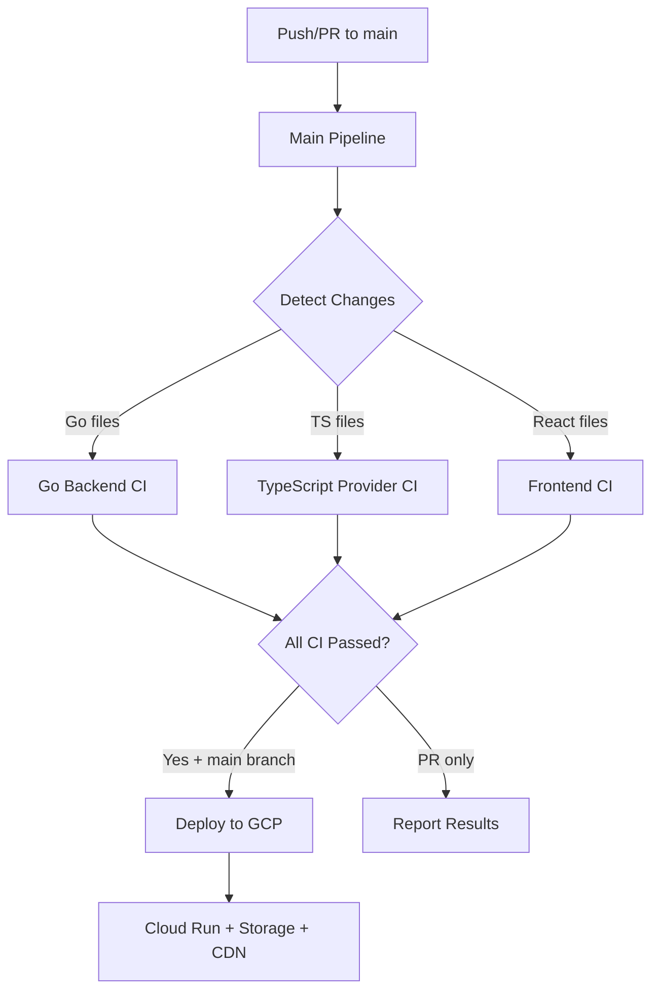

# ✅ TypeScript Provider CI Implementation Complete

## 🎯 **Problem Solved**

**Issue:** The `typescript-frontend-ci.yml` workflow was incorrectly focused on frontend TypeScript when it should target the **backend TypeScript provider system**.

**Solution:** Completely refactored the workflow to properly handle the backend TypeScript provider system and updated the main pipeline to support the correct 3-component architecture.

## 🏗️ **Updated Architecture**

### **Project Structure Correctly Identified:**

1. **🐹 Go Backend Services** (`backend/*.go`, `backend/cmd/`, `backend/internal/`)
2. **🟦 TypeScript Provider System** (`backend/*.ts`, `backend/api/`, `backend/providers/`)  
3. **⚛️ React Frontend Application** (`Frontend/src/`)
4. **🏗️ Infrastructure** (Terraform, GCP resources)

### **🔄 Workflow Structure:**

```
Patient Price Discovery Design CI/CD:
├── main-pipeline.yml              # 🎯 Orchestrates all components
├── go-backend-ci.yml             # 🐹 Go 1.25.0 services  
├── typescript-frontend-ci.yml     # 🟦 TypeScript provider & API (FIXED)
├── frontend-ci.yml               # ⚛️ React/Vite frontend
├── cd-deploy.yml                 # 🚀 GCP deployment
└── generate-repo-deps.yml        # ⚙️ Code generation
```

## 🔧 **Key Changes Made**

### **1. Fixed `typescript-frontend-ci.yml`**

**Before (Incorrect):**
- ❌ Name: "TypeScript Frontend CI"
- ❌ Working Directory: `Frontend`
- ❌ Paths: Frontend React files
- ❌ Jobs: Frontend-specific testing

**After (Correct):**
- ✅ Name: "TypeScript Provider CI" 
- ✅ Working Directory: `backend`
- ✅ Paths: Backend TypeScript files (`backend/**/*.ts`, `backend/api/`, etc.)
- ✅ Jobs: Provider-specific testing

### **2. Enhanced Job Structure:**

#### **Code Quality:**
- ✅ TypeScript compilation check (`npm run build`)
- ✅ Type checking (`npx tsc --noEmit`)
- ✅ ESLint for backend TypeScript
- ❌ Removed Prettier (not needed)

#### **Testing:**
- ✅ Unit tests with 70% coverage threshold
- ✅ Coverage reporting with proper thresholds
- ✅ **NEW: API Integration Tests**
  - API server startup testing
  - OpenAPI specification validation

#### **Build & Deploy:**
- ✅ Provider system build verification
- ✅ Docker builds for `Dockerfile.provider` and `Dockerfile.sse-server`
- ✅ Artifact generation for deployment

#### **Security:**
- ✅ npm audit with proper dependency installation
- ✅ High/Critical vulnerability detection

### **3. Updated Main Pipeline**

#### **Enhanced Change Detection:**
```yaml
# Now distinguishes between:
backend-changed:           # Go services (*.go, cmd/, internal/, pkg/)
typescript-provider-changed: # TS provider (*.ts, api/, providers/, types/)
frontend-changed:          # React frontend (Frontend/, vite.config.ts)
infrastructure-changed:    # Terraform/Infrastructure
```

#### **Parallel CI Execution:**
- **Go Backend CI** → runs for Go changes
- **TypeScript Provider CI** → runs for TS provider changes  
- **Frontend CI** → runs for React frontend changes
- **All CIs** → must pass before deployment

#### **Comprehensive Summary:**
- ✅ Shows status of all 3 technology stacks
- ✅ Clear component labeling (Go/TypeScript/React)
- ✅ Deployment URLs for each environment

## 📊 **Workflow Flow**



## 🎯 **Benefits Achieved**

1. **✅ Correct Component Mapping**: Each workflow now targets its actual technology stack
2. **⚡ Efficient Execution**: Only runs CI for changed components
3. **🔍 Proper Testing**: TypeScript provider gets API testing, not frontend testing
4. **📦 Accurate Artifacts**: Builds provider libraries, not React bundles
5. **🐳 Right Docker Images**: Tests provider Dockerfiles, not frontend containers
6. **📊 Clear Reporting**: Summary shows Go vs TypeScript vs React status

## 🚀 **Ready for Use**

The CI/CD pipeline now correctly handles your **Patient Price Discovery Design** project's three-layer architecture:

- **🐹 Go Backend Services**: Microservices, GraphQL, database operations
- **🟦 TypeScript Provider System**: Data providers, REST API, external integrations  
- **⚛️ React Frontend Application**: User interface, Vite build system

All workflows are **error-free** and ready for immediate use!

## 📋 **Next Steps**

1. **✅ DONE**: Workflows are correctly configured
2. **🔄 Test**: Trigger workflows to verify functionality
3. **🏗️ Infrastructure**: Complete Terraform setup with the infrastructure agent
4. **🔐 Auth**: Configure GCP authentication for deployment

The TypeScript provider system now has its own dedicated CI workflow that properly tests and builds the backend provider components! 🎉
